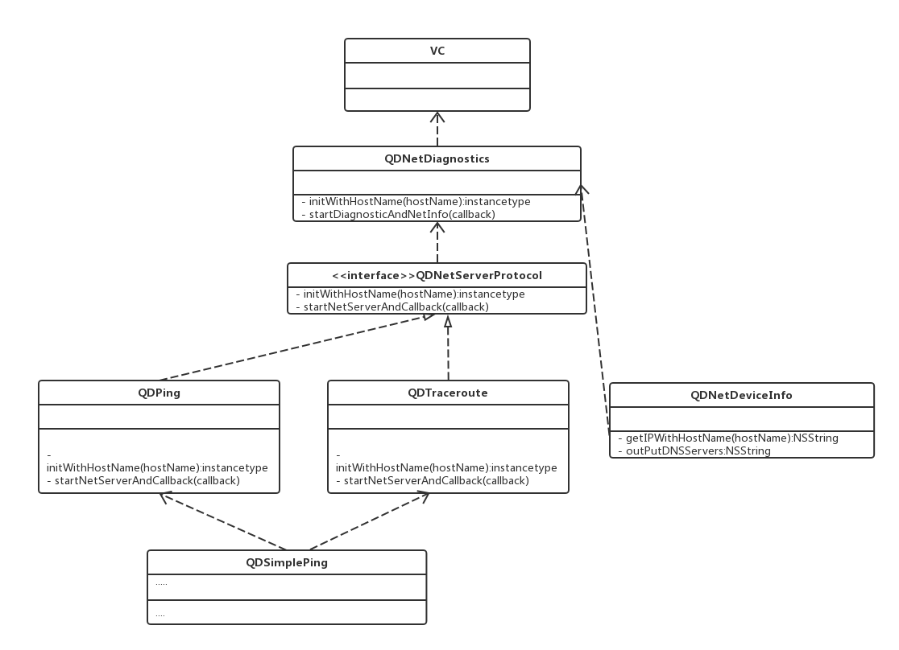

# QDNetDiagnostics

[](https://travis-ci.org/244514311@qq.com/QDNetDiagnostics)
[](https://cocoapods.org/pods/QDNetDiagnostics)
[](https://cocoapods.org/pods/QDNetDiagnostics)
[](https://cocoapods.org/pods/QDNetDiagnostics)

## Example

To run the example project, clone the repo, and run `pod install` from the Example directory first.

## Requirements

## Installation

QDNetDiagnostics is available through [CocoaPods](https://cocoapods.org). To install
it, simply add the following line to your Podfile:

```ruby
pod 'QDNetDiagnostics'
```

## Manual Installation 
依赖
```swift
CoreTelephony.framework
libresolv.tbd
```

## Usage

```Objc
// device info ping and traceroute
self.netDiagnostics = [[QDNetDiagnostics alloc] initWithHostName:@"www.suning.com"];

[self.netDiagnostics startDiagnosticAndNetInfo:^(NSString *info) {
NSLog(@"%@",info);
}];

// ping
//    [self.netDiagnostics startPingAndCallback:^(NSString *info) {
//        NSLog(@"%@",info);
//    }];

//traceroute
//    [self.netDiagnostics startTracerouteAndCallback:^(NSString *info) {
//        NSLog(@"%@",info);
//    }];
```
## Update
- 18.9.17
1 optimize code
2 add ping and traceroute api in QDNetDiagnostics

## Result


## UML


## Author

244514311@qq.com, 244514311@qq.com

## License

QDNetDiagnostics is available under the MIT license. See the LICENSE file for more info.
