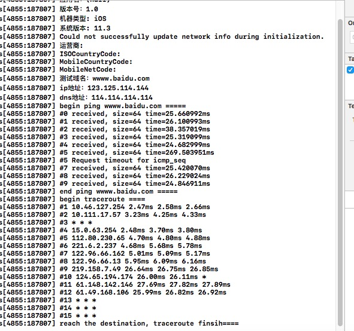

# QDNetDiagnostics
iOS网络测试小工具

依赖
```swift
CoreTelephony.framework
libresolv.tbd
```

使用
```swift
self.netDiagnostics = [[QDNetDiagnostics alloc] initWithHostName:@"wwww.baidu.com"];
[self.netDiagnostics startDiagnosticAndNetInfo:^(NSString *info) {
NSLog(@"%@",info);
}];
```

显示结果

